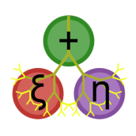

<p align="center">
  
</p>

# SyntaxTree.jl

*Toolset for modifying Julia AST*

[](https://travis-ci.org/chakravala/SyntaxTree.jl)
[](https://ci.appveyor.com/project/chakravala/syntaxtree-jl)
[](https://coveralls.io/github/chakravala/SyntaxTree.jl?branch=master)
[](http://codecov.io/github/chakravala/SyntaxTree.jl?branch=master)

This package is a general purpose toolkit intended for manipulations of Julia's AST. It contains methods like `linefilter!`, `callcount`, `genfun`, `genlatest`, and `exprval`.
Certain useful expression transformations are also possible, such as the `SyntaxTree.sub` method to convert scalar values to a single type, `SyntaxTree.abs` to apply `Base.abs` to all scalars and operations, and also `SyntaxTree.alg` to introduce an algebraic machine epsilon bound at each operation.

The `exprval` method to compute the expression value is defined in "Optimal polynomial characteristic methods" by Michael Reed in 2018 with the supporting `expravg` and `exprdev` methods to compute scalar averages and standard deviations for expressions. The expression value can be used to order equivalent forms of an expression, where lower values are more optimal and computationally efficient.

## Usage

Recursively filter out `:LineNumberNode` from `Expr` objects:
```Julia
julia> expr = quote
           x = 7
           y = x^2
       end
quote
    #= REPL[3]:2 =#
    x = 7
    #= REPL[3]:3 =#
    y = x ^ 2
end

julia> linefilter!(expr)
quote
    x = 7
    y = x ^ 2
end
```

Substitute numerical values with type conversion:
```Julia
julia> SyntaxTree.sub(Float64,:(2x^2-1//2))
:(2.0 * x ^ 2 - 1.0 // 2.0)
```

Apply `abs` to an expression recursively:
```Julia
julia> SyntaxTree.abs(:(2x^2-1//2))
:(2 * x ^ 2 + 1 // 2)
```

Recursively insert a machine epsilon bound `(1+ϵ)` per call:
```Julia
julia> SyntaxTree.alg(:(2x^2-1//2))
:((1 + ϵ) * ((1 + ϵ) * (2 * ((1 + ϵ) * x ^ 2)) - (1 + ϵ) * 1 // 2))
```

Return an anonymous function given `expr` and `args`
```Julia
julia> a = @genfun x^2-y^2 x y
#3 (generic function with 1 method)

julia> a(5,4)
9

julia> b = genfun(:(x^2-y^2),[:x,:y])
#1 (generic function with 1 method)

julia> b(5,4)
9
```
Optionally, `genlatest` or `@genlatest` can be used if `Base.invokelatest` is needed.

Obtain the number of `call` operations in an expression:
```Julia
julia> callcount(:(2x^2-1//2))
4
```

Recursively obtain the *number of scalars* in an expression, the *average of those scalars*, the *number of non-trivial exponents* in the expression, and the *average of the exponents*.
```Julia
julia> SyntaxTree.expravg(:(2x^2-1//2))
(3, 0.7954314537066303, 1, 2.0)
```

Get the *standard deviation* of the logarithm of the scalars in an expression:
```Julia
julia> SyntaxTree.exprdev(:(2x^2-1//2))
0.22136580504842668
```

Compute the expression value and other characteristics:
```Julia
julia> SyntaxTree.exprval(:(2x^2-1//2))
(4.89405674908118, 4, 0.4704952763295575, 0.7954314537066303, 2.0)
```
The **first** value is the *expression value*, the **second** is the *number of operations*, the **third** is the *standard deviation* of the logarithms of the scalars, the **fourth** is the *average* of the logarithms of the scalars, and the **fifth** is the *average of the exponents*.
